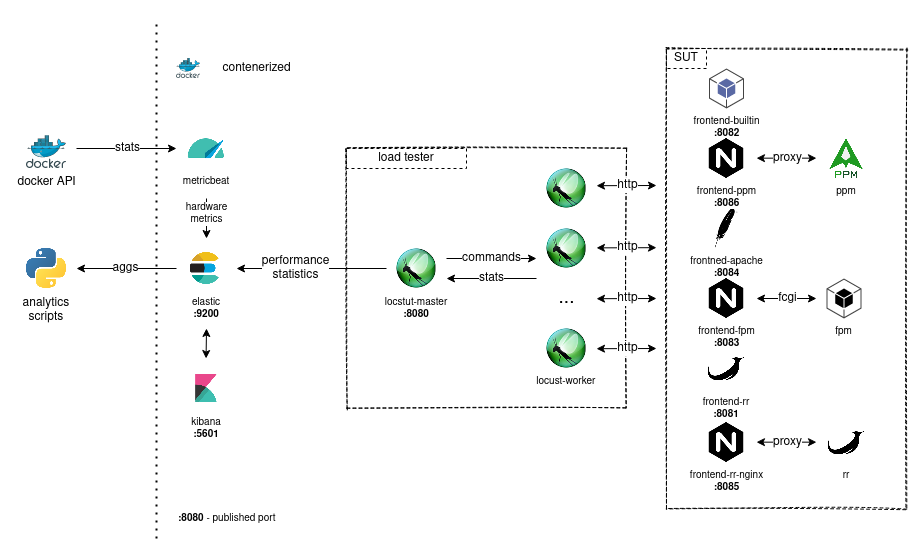

# Services architecture overview



**Figure 1. Benchmark architecture overview.**

This document aims to describe architecture of the project in more detail. The functional overview of the architecture is 
presented on the figure 1. In general, services can be categorized into three groups with different tasks, described 
in later sections. 

All the services are properly containerized and whole stack is described by the main `docker-compose.yml` file. 
Communication between load generator and system under test is meant to be done solely via the docker network created by 
`docker-compose`, ports from frontend services are exposed only for the user convenience.

## Metric collection
Services from this category are responsible for properly handling metrics and exposing them to further analysis. It 
consists of three independent services:

### ElasticSearch
```yaml
elastic:
  image: docker.elastic.co/elasticsearch/elasticsearch:7.11.0
  environment:
    - "discovery.type=single-node"
    - "ES_JAVA_OPTS=-Xms256m -Xmx256m"
  ports:
    - 9200:9200
  volumes:
    - esdata:/usr/share/elasticsearch/data
```

ElasticSearch is responsible for collecting and aggregating metrics collected from other services. In this case it 
is run in the `single-node` mode, which is not recommended for production usage. In the case of this particular 
application it can be used, as loss of the data would not be catastrophic. All persistent data is stored in the 
persistent docker volume, so it won't be lost after container recreation. The elasticsearch API is exposed to host 
by the standard port `9200`.

### Kibana
```yaml
kibana:
  image: docker.elastic.co/kibana/kibana:7.11.0
  environment:
    ELASTICSEARCH_HOSTS: http://elastic:9200/
  ports:
    - 5601:5601
  depends_on: ["elastic"]
```

Kibana is used to visualize and browse collected metrics. It can also be used to do simple analysis of the data and 
to develop queries and aggregations that could be later used by some scripts. It is exposed to the host by the 
standard port `5601`.

### Metricbeat
```yaml
metricbeat:
  image: docker.elastic.co/beats/metricbeat:7.11.0
  restart: on-failure
  user: root
  depends_on:
    - kibana
    - elastic
  volumes:
    - /var/run/docker.sock:/var/run/docker.sock:ro
    - ./docker/metricbeat.yml:/usr/share/metricbeat/metricbeat.yml:ro
    - metricbeat:/usr/share/metricbeat/data
  environment:
    - ELASTICSEARCH_HOST=http://elastic:9200
    - KIBANA_HOST=http://kibana:5601
```

The job of the metricbeat service is to collect information about hardware utilization and to push it to the 
elasticsearch. As we are interested only in per service stats, metrics are only collected from the [docker module][1]. 
Docker API is accessible to metricbeat via volume mount of host's docker socket. Metricbeat depends on fully 
bootstrapped kibana to work properly, but there is no simple solution to run it after kibana is ready - therefore it 
must be configured to restart after failure.

Exact configuration for this service can be found in [`/docker/metricbeat.yml`](../docker/metricbeat.yml) file.

## Load generation

The load is generated using [locust][2] - an open source load generator written in Python. It consists of two 
separate services master and worker. Load tasks are defined in the locust file which is mounted from
[`locust/locustfile.py`](../locust/locustfile.py). Load generation could be controlled by few environment variables:
 - `LOCUST_TAGS` (default: `light`) - determines which tasks should be executed by [tags][3];
 - `LOCUST_MAX_USER_COUNT` (default: `250`) - max simulated user count;
 - `LOCUST_TIME_LIMIT` (default: `500`) - maximum load time, in seconds;

### Locust (master)
```yaml
locust-master:
  build: locust
  environment:
    - ELASTICSEARCH_HOST=http://elastic:9200
    - LOCUST_TIME_LIMIT
    - LOCUST_MAX_USER_COUNT
  ports:
    - "8080:8089"
  volumes:
    - ./locust:/mnt/locust
  command: "-f /mnt/locust/locustfile.py --tags ${LOCUST_TAGS:-light} --master -H http://locust-master:8089"
```

The role of the master is to send commands and oversee workers. It is also responsible for collecting statistics 
from workers and submitting them to the elasticsearch. Locust HTTP interface can be accessed by published port `:8080`.

### Locust (worker)
```yaml
locust-worker:
  build: locust
  environment:
    - LOCUST_TIME_LIMIT
    - LOCUST_MAX_USER_COUNT
  volumes:
    - ./locust:/mnt/locust
  command: "-f /mnt/locust/locustfile.py --tags ${LOCUST_TAGS:-light} --worker --master-host locust-master"
```

The sole purpose of the workers is to simulate users and generate load on the SUT. Requests results are then sent to 
the master node for further processing. This service is typically scaled up to few nodes. **For default settings 
minimum of 3 workers is recommended.** 

## System(s) Under Test

The last group is made of different types of servers that will be tested. Services could be further divided into 
groups associated with each test case. Every group has one _frontend_ service that serves application via HTTP 
protocol. Some frontends are standalone i.e. one service is responsible for both PHP and static files, and some, 
like nginx+fpm pair, divide this concerns into different services. 

Every image (except for nginx) is built from the [official php images][5] using process similar to the multistage build.
All sources are built as part of `:base` (Dockerfile: [`base.Dockerfile`](../base.Dockerfile)) version of the image. 
This allows final images to be 
based on 
the proper
base image (like for example `-fpm` variant) by copying contents of `/var/www` directory. 

### PHP builtin server (php -S)
```yaml
frontend-builtin:
  image: symfony-demo:builtin
  ports:
    - 8082:8080
```

This is the simplest possible setup. All content is served by the [PHP's builtin developer server][4]. One important 
remark is that this setup is not intended to be used in production and is included only for the comparison sake. 
The Dockerfile used for this case is [`builtin.Dockerfile`](../builtin.Dockerfile).

### Apache (mod_php)
```yaml
frontend-apache:
  image: symfony-demo:apache
  ports:
    - 8084:80
```

This case consists of standalone Apache server with `mod_php`, default configuration from the [official php image][5] 
is used. The Dockerfile used for this case is [`apache.Dockerfile`](../apache.Dockerfile).

### NGiNX + FPM
```yaml
frontend-fpm:
  image: nginx:latest
  volumes:
    - ./public:/var/www/public
    - ./docker/nginx-fpm.conf:/etc/nginx/conf.d/default.conf
  ports:
    - 8083:8080
  depends_on:
    - fpm

fpm:
  image: symfony-demo:fpm
```

This is current _de facto_ standard for hosting PHP projects. Nginx is responsible for static content and HTTP 
connections and processing of PHP scripts is handled by the [FPM][6]. For the nginx the official image is used, fpm 
service is built from [`fpm.Dockerfile`](../fpm.Dockerfile).

### Roadrunner (standalone)
```yaml
frontend-rr:
  image: symfony-demo:rr
  ports:
    - 8081:8080
```

This case is based on standalone [RoadRunner][7] PHP application server. This is somewhat new solution to the PHP
hosting problem and uses long-running workers that can keep state between requests, significantly speeding up the
application. Dockerfile ([`rr.Dockerfile`](../rr.Dockerfile)) for that case is based on the Dockerfile provided by the
[`baldinof/roadrunner-bundle`][8].

### NGiNX + PHP-PM
```yaml
frontend-ppm:
  image: nginx:latest
  volumes:
    - ./public:/var/www/public
    - ./docker/nginx-ppm.conf:/etc/nginx/conf.d/default.conf
  ports:
    - 8086:8080
  depends_on:
    - ppm

ppm:
  image: symfony-demo:php-pm
  env_file:
    - .env
  environment:
    - APP_ENV=prod
```

[PHP Process Manager (PHP-PM)][9] is another solution based on the same principle as the RoadRunner but written 
entirely in PHP. The Dockerfile used for this case is [`ppm.Dockerfile`](../ppm.Dockerfile), and is based on 
the recommended configuration.

### NGiNX + Roadrunner
```yaml
frontend-rr-nginx:
  image: nginx:latest
  volumes:
    - ./docker/nginx-rr.conf:/etc/nginx/conf.d/default.conf
  ports:
    - 8085:8080
  depends_on:
    - rr
    
rr:
  image: symfony-demo:rr
```

This is basically the same case as standalone RoadRunner, but this time nginx is responsible for HTTP connections 
and serving static content. This is recommended solution for most cases, but is not standalone and requires two 
services.

[1]: https://www.elastic.co/guide/en/beats/metricbeat/current/metricbeat-module-docker.html
[2]: https://locust.io/
[3]: https://docs.locust.io/en/stable/writing-a-locustfile.html#tag-decorator
[4]: https://www.php.net/manual/en/features.commandline.webserver.php
[5]: https://github.com/docker-library/php
[6]: https://www.php.net/manual/en/install.fpm.php
[7]: https://roadrunner.dev/
[8]: https://github.com/baldinof/roadrunner-bundle
[9]: https://github.com/php-pm/php-pm
